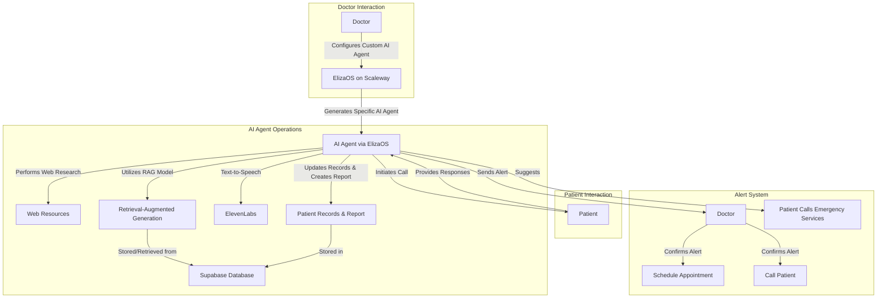

# Proactive Follow-Up for High-Risk Patients

## 📌 Description
This project aims to reduce rehospitalization risks for high-risk patients (post-operative, chronic diseases, postpartum, etc.) through a proactive artificial intelligence system. Doctors can configure a custom AI agent based on the patient's pathology, particularly in geriatrics, where multiple agents collaborate for optimal monitoring.

## Overview
This AI-powered system enhances interactions between doctors and patients by integrating:
- **Web research** for relevant medical insights
- **Retrieval-Augmented Generation (RAG)** for intelligent responses
- **Text-to-speech** capabilities for communication
- **Automated patient record management and reporting**

## Workflow Diagram

## Features
### **Doctor Interaction**
- Configure a custom AI agent via ElizaOS hosted on Scaleway.

### **AI Agent Operations**
- Generates AI agents for personalized patient monitoring.
- Conducts **web research** for relevant medical insights.
- Uses a **RAG model** for enhanced information retrieval.
- Stores and retrieves patient data from **Supabase Database**.
- Provides **text-to-speech** functionality for seamless interaction.
- Updates patient records and generates **automated reports**.

### **Patient Interaction**
- AI agent **initiates calls** to check on the patient.
- Patients **respond to health inquiries**, and AI processes the responses.

### **Alert System**
- AI detects warning signs and **sends alerts** to doctors.
- Can **suggest emergency services** if needed.
- Doctors can confirm alerts and take appropriate action:
  - **Schedule an appointment**
  - **Call the patient for further assessment**

## Data Management
- **Supabase Database** stores patient records and reports.
- Dynamic retrieval and updates ensure **real-time data availability**.

## How It Works
1. **Doctor configures** an AI agent for **tailored patient follow-up**.
2. AI conducts **regular health assessments** using personalized questions.
3. **Intelligent response analysis** powered by **RAG** and **web research**.
4. Three possible scenarios:
   - ✅ **All is well** → Normal follow-up.
   - ⚠️ **Warning signs detected** → Preventive intervention.
   - 🚨 **Health deterioration** → Immediate alert and human intervention.
5. Proactive medical team **validates alerts** and schedules appointments as needed.

## Key Benefits
✅ **Reduced rehospitalization rates** through real-time monitoring. \
✅ **Optimized healthcare professional time** with AI automation. \
✅ **Enhanced patient experience** through personalized support. \
✅ **Seamless automation** while maintaining human supervision.

## Conclusion
This AI-driven system streamlines doctor-patient interactions, automates record-keeping, and enhances patient safety through **real-time alerts and recommendations**, ultimately improving healthcare outcomes.

**Powered by  ElizaOS**
